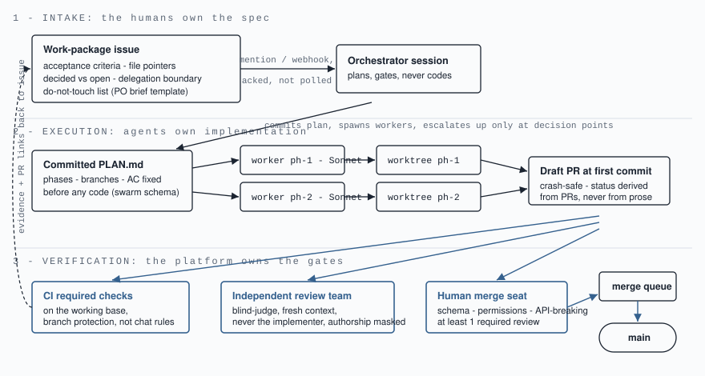

# pkit

Pavel's personal Claude Code plugin marketplace.

Eight plugins, installed individually. Two things live here: skills that have
already earned their keep in real work, and the working-mode machinery that
came out of running multi-agent epics and watching them break.

## Why I'm building this

I run Keboola. I want to ship production code with my team, and I want my team
to trust what I ship.

Agents made writing code cheap. Then we ran a 3-day epic where an autonomous
loop merged roughly 30 PRs, and it broke 5 times. Every break was coordination
or verification: green claims without CI, briefs lost by a polling loop, status
drifting from reality, finished work eaten by a crash, gates relaxed one by one
under deadline pressure. The code itself held up.

So this kit answers one specific question: what has to exist so a human plus
their agents (a Kentaur) can work an epic next to 2 other Kentaurs, and the
result is trustworthy by construction, whoever typed it?

The bets:

- Rules live in the platform (checks, hooks, branch protection). Docs are for
  humans and audit; agents open a repo's decision file in about 3.5% of runs.
- Decisions are append-only records. Exceptions carry a compensating control
  and an expiry date.
- The judge is never the author. Fresh context, masked authorship,
  deterministic tests first.
- Status is derived from PRs, never asserted in prose.
- The mode versions itself and keeps a ledger of what broke. It should get
  better every epic.

If this works, the interesting consequence is interop: any agent from any
vendor can join an epic through the issue plus PR plus gates contract. That's
the world I want to work in.

## Install

```
/plugin marketplace add PavelDo/pkit
/plugin install <name>@pkit
```

For example:

```
/plugin install troika-mode-1707@pkit
/plugin install blind-judge@pkit
```

Then, in any session inside the repo, say "set up pkit in this repo". That
scaffolds the four host-repo artifacts (via `decision-log`): `decisions/`
with `RULES.md` (re-emitted into every session by `session-rules`), the
append-only guard test in `tests/`, and `BACKLOG.md` — the ideas place,
where an idea is parked as one entry instead of being built mid-epic. Ideas
for pkit itself go through [idea issues](../../issues/new?template=idea.yml).

## The flow

The end-to-end working mode the plugins implement, stage by stage (who does
what, how, and what comes out): [docs/FLOW.md](docs/FLOW.md).



## Plugins

| Plugin | What it does | Origin |
|--------|--------------|--------|
| `research` | Deep research engine — market analysis, competitive intelligence, thesis stress testing. Behaves like a skeptical investor rather than a summarizer. | pcrew |
| `vibecoding` | Testing methodology for UI built with AI: seed first, assert on content not structure, test the JS path. Prevents green suites over broken UIs. | pcrew |
| `swarm` | Phased-plan execution: worker agents in isolated git worktrees, fresh-context judge, three-strike retry, stops at an open PR. | adapted from padak/claude-code-kit |
| `second-opinion` | External opinion from Codex, Gemini or Claude Code CLIs. Single provider or multi-model consensus. | padak/claude-code-kit |
| `troika-mode-1707` | The working mode: Kentaurs, three per epic, the epic issue as the room, derived status, shared gates, mode-routing intake, model policy, append-only lessons ledger. | original |
| `decision-log` | Append-only decision records — PRD-D, ARCH-D, JUDGE-V, GATE-X, MODEL-R, TEST-D — plus a pytest guard that fails CI when a record is edited. | original |
| `blind-judge` | Fresh-context judging: oracles first, judge blind to authorship, one judge per rubric dimension, consolidator that fails loudly on missing reports. | original |
| `session-rules` | Hooks that surface the host repo's decision records into the session and re-emit a short `decisions/RULES.md` on every prompt. | original |

## How they fit together

`troika-mode-1707` is the mode; the rest are its machinery.

```
troika-mode-1707  ──  chooses the shape of the work (think / solo / troika / fan-out)
      │
      ├── swarm          ── executes a phase in a worktree, opens a draft PR
      │      └── blind-judge  ── reviews it from an empty context window
      │
      ├── decision-log   ── records what was decided (PRD-D, ARCH-D, GATE-X, JUDGE-V)
      └── session-rules  ── reads those records back into the next session
```

Each is usable on its own. `research`, `vibecoding` and `second-opinion` are
independent of the mode entirely.

## Provenance

- **`research`, `vibecoding`** — imported from
  [`pcrew`](https://github.com/PavelDo/pcrew), Pavel's skill collection.
  Content unchanged apart from frontmatter normalization.
- **`swarm`, `second-opinion`** — adapted from
  [padak/claude-code-kit](https://github.com/padak/claude-code-kit) by Petr
  Simecek. Credit to him for both. `second-opinion` is imported as-is. `swarm`
  is modified: the reviewer is now a separate fresh-context judge instead of
  the orchestrator reviewing its own spawn, deterministic oracles run before
  judgment, and the happy path ends at an open PR rather than an automatic
  squash-merge.
- **`troika-mode-1707`, `decision-log`, `blind-judge`, `session-rules`** — original
  to this kit. `troika-mode-1707` v0.1 was
  `keboola/agnes-the-ai-analyst#1707`, run by hand in August 2026; its five
  documented breakdowns seed the lessons ledger.
- The evals design (Tier-0 static checks now, Tier-1 trigger evals next) is
  borrowed from `keboola/ai-kit`.

## Validation

```bash
python3 evals/validate.py
```

Tier-0 static checks: frontmatter presence, skill name matching its directory,
marketplace and plugin.json version lockstep, description length, plugin
directories existing. Runs on every push and PR via
`.github/workflows/evals.yml`.

Tier-1 (trigger evals — does the skill fire on the phrases it claims?) is
specified in `evals/trigger-evals/README.md` and is a v1 gate, not a v0.1 one.

## Conventions

See `CLAUDE.md` for the kit's own rules: one skill per plugin, version
lockstep, the trigger-eval bar before v1, and which sections are append-only.
