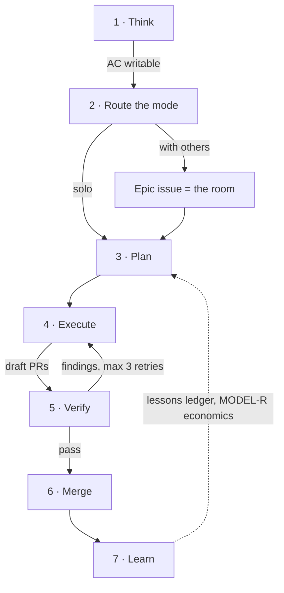

# The flow

The end-to-end working mode, stage by stage: what happens, who does it, how it
is done, and what comes out. Each stage names the pkit or gstack tool that
carries it. This is the architecture the plugins implement — read it once,
then let the tools enforce it.

## Stage 1 — Think

**What:** turn a raw idea into a design with writable acceptance criteria.
Nothing downstream works without verifiable criteria: the judge has nothing to
judge and the blocks have nothing to close against.

**Who:** the Kentaur, interactively — the human half drives, the agent
challenges premises and drafts.

**How:** `gstack /office-hours` (premise challenge, mandatory alternatives) or
`gstack /spec` (vague intent to precise spec). Stay here until the acceptance
criteria can be written down. Decisions made along the way become **PRD-D**
records (`decision-log`).

**Output:** design doc, acceptance criteria, PRD-D records.

## Stage 2 — Route the mode

**What:** pick how the work will run, on the record.

**Who:** the agent **proposes** by running the four-question rubric; the human
half of the Kentaur **ratifies** as part of plan approval.

**How:** the intake in `troika-mode-1707`: criteria writable? solo or with
others? production exposure? parallelizable or larger than one context window?
The answers land as one PRD-D line. Working with others means Troika 1707: an
epic issue with an immutable decisions header and work blocks with explicit
`Depends-on` edges, at most three Kentaurs, claiming by tracker assignment.

**Output:** the mode, recorded. For Troika 1707, the epic issue (the room).

## Stage 3 — Plan

**What:** decompose into phases with branches, dependency edges, and per-phase
acceptance criteria, committed to a file before any code.

**Who:** the orchestrator — **Opus at high effort** by default. The frontier
tier earns its seat only when the work exceeds one context window or fans out
very wide.

**How:** the `swarm` plan schema: phase blocks with Branch, Depends-on, Scope,
Acceptance Criteria, Tests. Architecture choices become **ARCH-D** records,
each naming its enforcement guard. Model choices per phase become **MODEL-R**
records.

**Output:** the committed plan, ARCH-D and MODEL-R records.

## Stage 4 — Execute

**What:** build the phases.

**Who:** worker agents — **Sonnet, pinned explicitly** (never inherited from
the session), identical model and effort across parallel siblings so they share
the prompt-cache prefix. One worker per phase, each in its own git worktree.

**How:** `swarm` spawns workers with the announced rubric (they know exactly
what the judge will check). **Draft PR at the first commit** — a crash cannot
eat work, and status is derived from PR state, never asserted in comments.

**Output:** draft PRs, one per phase.

## Stage 5 — Verify

**What:** decide whether a phase is actually done.

**Who:** deterministic oracles first, then a **fresh-context judge that never
learns who wrote the code** (`blind-judge`). Never the orchestrator — it
commissioned the work and has the most polluted context in the system.

**How:** tests, types, lint, and any repo guard suites run first; a red oracle
is an automatic `findings` verdict with no judge tokens spent. The judge then
works the evidence rubric per dimension (correctness, security, architecture,
tests), staffed by changed paths via `panel.yaml`. Verdicts follow the
machine-parseable `VERDICT:` grammar. Findings loop back to the worker, at most
three retries, then escalate to a human. Verdicts become **JUDGE-V** records.

**Output:** PRs marked ready, with verdicts on the record.

## Stage 6 — Merge

**What:** land it.

**Who:** the platform plus a human. CI required checks gate every PR; a
**human merge seat** owns anything touching schema, permissions, or a public
API contract. The swarm never merges — it stops at an open PR.

**How:** branch protection and required checks on the working base (rules that
live in chat erode; rules in the platform do not). Relaxing any gate under
pressure requires a **GATE-X** record with a compensating control and an expiry
date.

**Output:** merged code, or a recorded exception.

## Stage 7 — Learn

**What:** make the next run better than this one.

**Who:** the Kentaur, briefly, at the end of an epic or a week.

**How:** delta-append to the `troika-mode-1707` Lessons ledger (never rewrite —
rewritten context collapses). Log per-run economics: model, cost,
verified-done or false-done, feeding future MODEL-R routing. `gstack /retro`
for the weekly view. Repeated advisory findings get promoted into mechanical
guards — a finding a script could have caught becomes a script.

**Output:** ledger entries, economics data, new guards.

---

## The rule underneath all seven stages

Decisions are **records** (append-only, in `decisions/`). Behavior is
**enforcement** (always-on context, hooks, CI guards). Agents open a repo's
decision file on their own in about 3.5% of runs — so a record without its
guard is a wish, and every ARCH-D ships with the name of the check that
enforces it.
